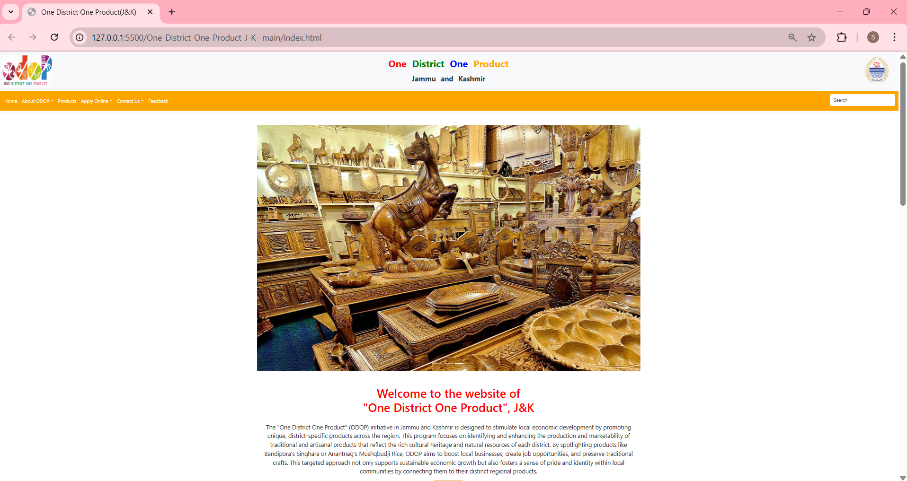
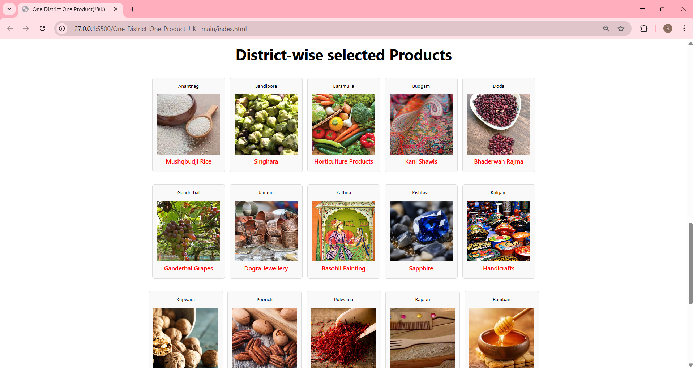

# 🧵 One District One Product – Jammu & Kashmir

A web-based initiative to promote and showcase district-specific products from Jammu & Kashmir under the **ODOP (One District One Product)** scheme. This project highlights traditional, cultural, and artisanal products, supporting local economies and preserving heritage.

---

## 📌 Overview

This project aims to:

- Present detailed insights into unique products from each district.
- Educate visitors about the cultural and economic value of each product.
- Provide a visually engaging and informative experience.

---

## 📸 Project Screenshots

<p align="center">
  
  
</p>

---

## 🚀 Features

- ✅ **District-wise Product Pages**  
  Explore unique products across all districts with dedicated pages.

- 🗺️ **Interactive & Informative UI**  
  Images, descriptions, and styles tailored to each region.

- 📱 **Responsive Design**  
  Fully mobile-friendly layout for accessibility on all devices.

- 🛍️ **Seller Section** *(optional)*  
  Placeholder for seller/product submissions or future enhancements.

---

## 🛠️ Tech Stack

- **HTML** – Web page structure  
- **CSS** – Styling and responsiveness  
- **JavaScript (optional)** – For interactivity  
- **Images** – Product and cultural visuals

---

## 📁 Project Structure

```text
One-District-One-Product-J-K--main/
├── index.html
├── styles.css
├── privacy.html
├── districts/
│   ├── anantnag/
│   ├── bandipore/
│   └── ... (other districts)
├── seller/
├── images/
└── README.md
```


---

## 🧑‍💻 How to Run Locally

To view the project in your browser:

1. **Download** or **clone** the repository.
2. Navigate to the project folder.
3. Open `index.html` in your browser.

```bash
git clone https://github.com/rishitagpt/odop-jk.git
cd odop-jk
open index.html
